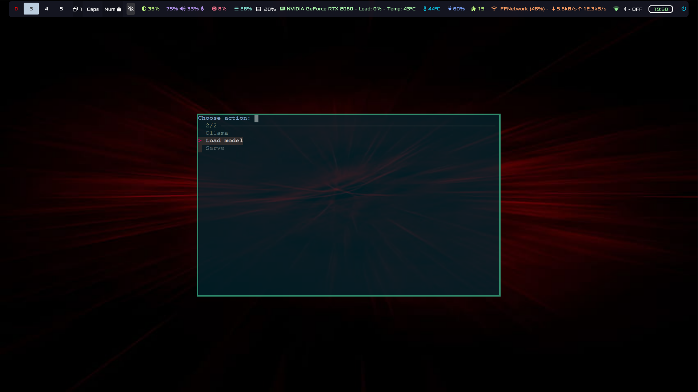
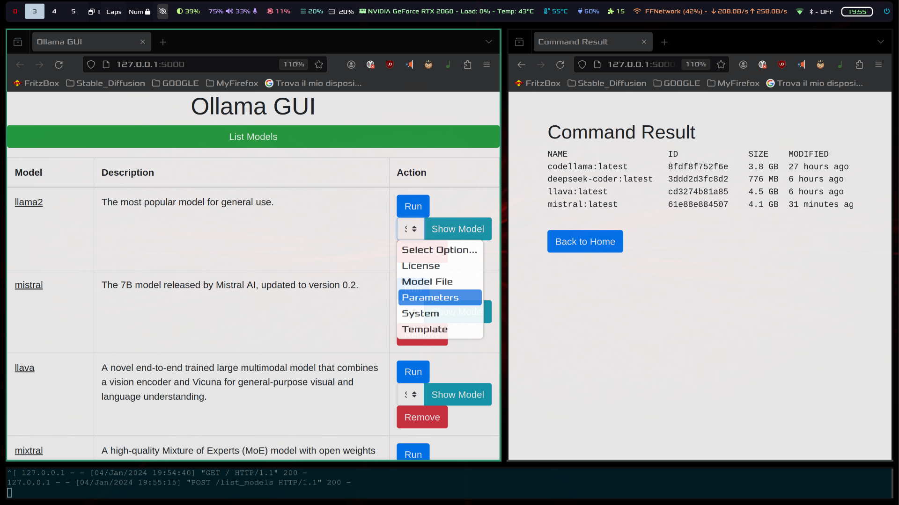
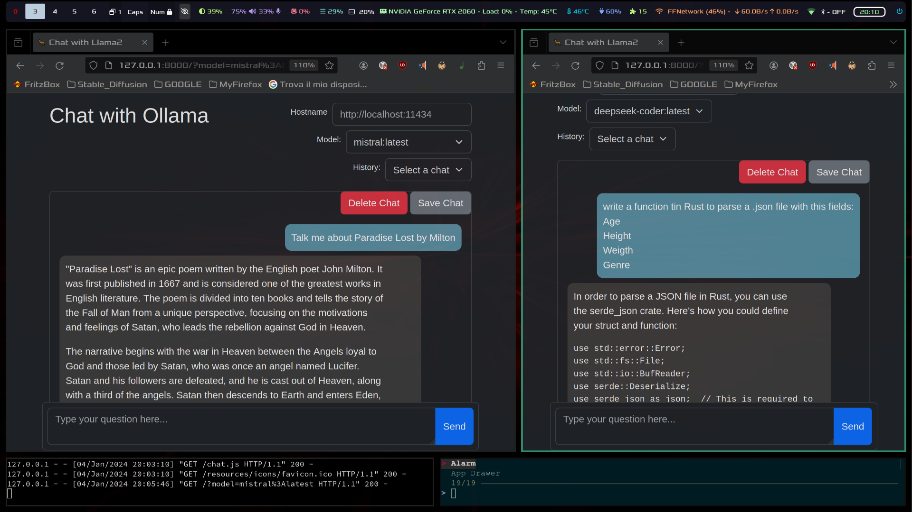

### Overview

Just a simple HTML UI for Ollama

Now available as a chrome extension!
https://chrome.google.com/webstore/detail/ollama-ui/cmgdpmlhgjhoadnonobjeekmfcehffco

<p align="center">
  
  
</p>

### Screenshots






## Dependencies

- [Bash](https://www.gnu.org/software/bash/)
- [Python](https://www.python.org/)
- [fzf](https://github.com/junegunn/fzf)
- [Ollama](https://github.com/jmorganca/ollama)

## Usage

- Clone the repository and open the directory
```
git clone https://github.com/ollama-ui/ollama-ui &&cd ollama-ui
```
- Install the dependencies
-Run the build
```
make
```
- Open http://localhost:8000 in your browser

### Serve

The script is used to run the command `ollama serve` and run the chat in a web server.

```
sh serve.sh
```

### Load

The script is used to list/run/show/delete the desired LLM models through a web-UI based on Python and the Flask framework.
It assumes you created a python virtual environment called "model_chooser" in the same directory of the script.
It activates the virtual environment and installs the requirements through pip.

```
sh load.sh
```

### Choose

The script is used to choose the action you want to perform, being either `load` or `serve`.
It obviously relies on bash, pythona and ollama, but it also requires the installation of fzf.
If any of these are not satisfied, the script will fail.

```
sh choose.sh
```

## License

This project is licensed under the MIT License.


