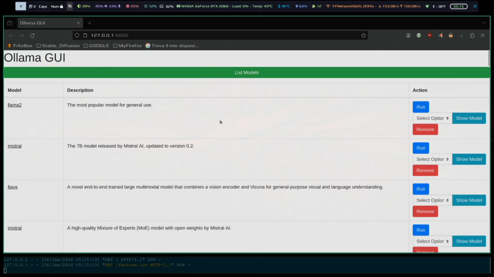

# Ollama GUI

### Overview
Ollama GUI is a simple Web UI designed for interacting with Ollama, a large language model runner. This interface provides a user-friendly way to execute various Ollama commands, such as running, showing, and removing models.

[](media/demo.mp4/)

**Disclaimer**
This is a personal project and it  is not affiliated with the Ollama project and is not affiliated with the Ollama team in any way.

## Installation

Install Ollama (https://github.com/jmorganca/ollama):

```
curl https://ollama.ai/install.sh | sh
```

## Official documentation:
https://github.com/ollama-ui/ollama-ui

Clone the repository:

```
git clone https://gitlab.com/fatualux/Python_Scripts
```

Navigate to the Ollama directory:

```
cd Python_Scripts/ollama/
```

Install the required dependencies:

```
python -m pip install -r requirements.txt
```

## Usage

Run the Ollama GUI application:

```
python app.py
```

Access the application in your web browser at http://127.0.0.1:5000.
Dependencies

-    Python
-    Pip
-    Flask
-    Flask-SocketIO

## License

[](https://www.gnu.org/licenses/gpl-3.0.en.html)

This project is licensed under the GPLv3 license. See the LICENSE file for more details.
